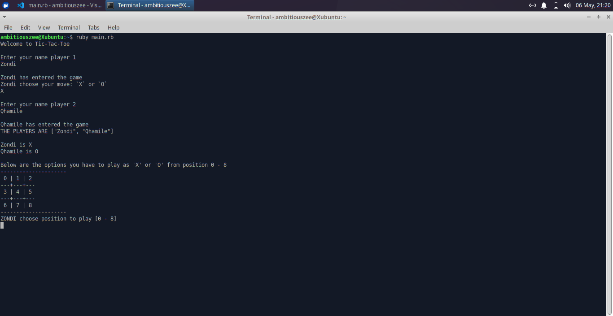

# tic-tac-toe
> [!NOTE]
> The user interface of the game is on the command line ran by the command `irb -r file_name.rb`
> if you have ruby installed 

# Aim of project 
This is a simple game of TicTacToe where two players play against each other wil representitive letters of `X` and `O`.

the structure of game looks like this below:


The first player to draw their *representitive letter* (X/O) diagonally, horizontally in any directon 3 times in a row wins

> [!NOTE]
> ***BELOW IS THE PLANNING OF THE PROJECT***

## Development 
**I will create the same logic of a game using _Object Oriented Programming_**
The program must support `Encapsulation` and `Exception Handling`

## Structure 
- There will be a `Class` for controlling amount of players and their moves => Players
- There will be a `Class` for controlling the loop of the game => Game

1. The board will be seperated into rows and columns and one diagonal
2. They will keep track of when one player will win
3. A single round will be played each time 

The project is seperated into 2 **phases**

- **Phase 1** => It gets all the info from 2 players needed the image below shows


- **Phase 2** => It is the loop of the game, it ends when there is a recognisable winner


## Challenges and Solutions
- I had trouble using the `loop` to control user input 
- I had trouble controlling the loop for the game 

- [x] I first put the user input outside the loop but then i realised it makes more sense when its inside

```
move = String.new

until move == 'X' of move == 'O'
    ...
end
```
The code will run till player puts in `X` or `O`

## What i learnt
- Turns out you can actually change an element in an array like this: `array[i] = value`
- Subclasses can also inherit class variables from superclass
- You can use enumarable methods on an `if statement` 

e.g 
```
if array.all? {|el| condition}
  ...
end
```
the code block runs when if statememt returns true